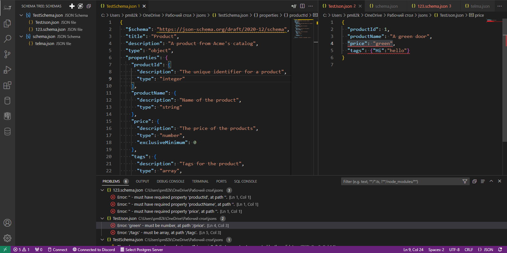
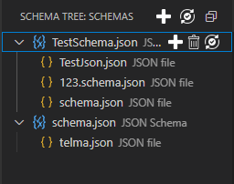
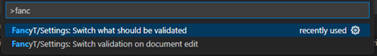
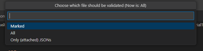

# FancyT-JSV

### This extension is brought to ease the work of creation of multiple JSON schemas!

## Features

### This extension provides a tree-like structure where roots are JSON schemas and leaves are JSON files, that are going to validate against its root schemas.

* You can add to tree your JSON schema files and then attach any JSON file to validate against schema!
* You can add same file to different roots or as a root.

* You can choose, what to validate: \
To validate one file in a tree - press  button on the entry\
To validate a json schema and every attached file to it - press  button on the root entry\
To validate everything - press  button on the top of the tree

### It is possible, to change behaviour on validation, so:

 

* You can change behaviour of what would be validated: \
 \
"All" - Everything will be validated (JSON schemas will be validated against its draft metaschema) \
"Marked" - Only marked entries will be validated \
"Only (attached) JSONs" - JSON schemas in roots won't be validated

* You can change, if file should be validated while you changing it.
* You can replace any root schema to another by pressing RMB on it and selecting "Change schema". \
 If a chosen schema's already a root, every attached files will be reattached to a new root 

### Working with $ref keyword:

 

* You can throw all of your referenced schemas in your main schema. Just attach some to the respected schema node in the reference tree!  

> ### Consider that!
> **Since AJV needs to be fed by js object, extension can't show errors in referenced schema file, so if you want to validate the referenced file itself, you should put it to the schema tree** 

## Known issues

* Validation setting "Marked" works like "All"

## Planned features

* Drag'n'drop new files into tree
* Drag'n'drop file links between roots
* Drag'n'drop copy file links between roots
* Make "Marked" setting work, so only marked entries will validate

## Release Notes
### 1.2 
#### Additions:
* Added new Reference tree to work with $ref key word
#### Fixes:
* Fixed some grammar errors
* Fixed some minor bugs 

### 1.0 is out!
